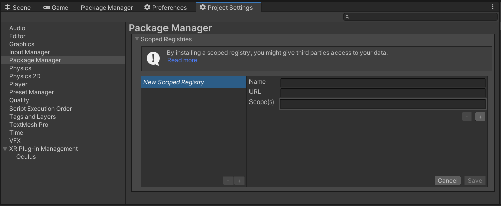

# com.utilities.websockets

[](https://discord.gg/xQgMW9ufN4) [](https://openupm.com/packages/com.utilities.websockets/) [](https://openupm.com/packages/com.utilities.websockets/)

A simple websocket package for the [Unity](https://unity.com/) Game Engine.

## Installing

Requires Unity 2021.3 LTS or higher.

The recommended installation method is though the unity package manager and [OpenUPM](https://openupm.com/packages/com.utilities.websockets).

### Via Unity Package Manager and OpenUPM

#### Terminal

```terminal
openupm add com.utilities.websockets
```

#### Manual

- Open your Unity project settings
- Select the `Package Manager`

- Add the OpenUPM package registry:
  - Name: `OpenUPM`
  - URL: `https://package.openupm.com`
  - Scope(s):
    - `com.utilities`
- Open the Unity Package Manager window
- Change the Registry from Unity to `My Registries`
- Add the `Utilities.Websockets` package

### Via Unity Package Manager and Git url

> [!WARNING]
> This repo has dependencies on other repositories! You are responsible for adding these on your own.

- Open your Unity Package Manager
- Add package from git url: `https://github.com/RageAgainstThePixel/com.utilities.websockets.git#upm`
  - [com.utilities.async](https://github.com/RageAgainstThePixel/com.utilities.async)

---

## Documentation

### Table Of Contents

- [Connect to a Server](#connect-to-a-server)
- [Handling Events](#handling-events)
  - [OnOpen](#onopen)
  - [OnMessage](#onmessage)
  - [OnError](#onerror)
  - [OnClose](#onclose)
- [Sending Messages](#sending-messages)
  - [Text](#sending-text)
  - [Binary](#sending-binary)
- [Disconnect from a Server](#disconnect-from-a-server)

### Connect to a Server

To setup a new connection, create a new instance of WebSocket and subscribe to event callbacks, and call `Connect` or `ConnectAsync` methods.

> [!IMPORTANT]
> WebSocket implements `IDisposable` and should be properly disposed after use!

```csharp
var address = "wss://echo.websocket.events";
using var socket = new WebSocket(address);
socket.OnOpen += () => Debug.Log($"Connection Established @ {address}");
socket.OnMessage += (dataFrame) => {
    switch (dataFrame.Type)
    {
        case OpCode.Text:
            AddLog($"<- Received: {dataFrame.Text}");
            break;
        case OpCode.Binary:
            AddLog($"<- Received: {dataFrame.Data.Length} Bytes");
            break;
    }
};
socket.OnError += (exception) => Debug.LogException(exception);
socket.OnClose += (code, reason) => Debug.Log($"Connection Closed: {code} {reason}");
socket.Connect();
```

> [!NOTE]
> `socket.ConnectAsync()` is blocking until the connection is closed.

### Handling Events

You can subscribe to the `OnOpen`, `OnMessage`, `OnError`, and `OnClose` events to handle respective situations:

#### OnOpen

Event triggered when the WebSocket connection has been established.

```csharp
socket.OnOpen += () => Debug.Log("Connection Established!");
```

#### OnMessage

Event triggered when the WebSocket receives a message. The callback contains a data frame, which can be either text or binary.

```csharp
socket.OnMessage += (dataFrame) => {
    switch (dataFrame.Type)
    {
        case OpCode.Text:
            AddLog($"<- Received: {dataFrame.Text}");
            break;
        case OpCode.Binary:
            AddLog($"<- Received: {dataFrame.Data.Length} Bytes");
            break;
    }
};
```

#### OnError

Event triggered when the WebSocket raises an error. The callback contains an exception which can be handled, re-thrown, or logged.

```csharp
socket.OnError += (exception) => Debug.LogException(exception);
```

#### OnClose

Event triggered when the WebSocket connection has been closed. The callback contains the close code and reason.

```csharp
socket.OnClose += (code, reason) => Debug.Log($"Connection Closed: {code} {reason}");
```

### Sending Messages

#### Sending Text

Perfect for sending json payloads and other text messages.

```csharp
await socket.SendAsync("{\"message\":\"Hello World!\"}");
```

#### Sending Binary

Perfect for sending binary data and files.

```csharp
var bytes = System.Text.Encoding.UTF8.GetBytes("Hello World!");
await socket.SendAsync(bytes);
```

### Disconnect from a Server

To disconnect from the server, use `Close` or `CloseAsync` methods and dispose of the WebSocket.

```csharp
socket.Close();
socket.Dispose();
```
