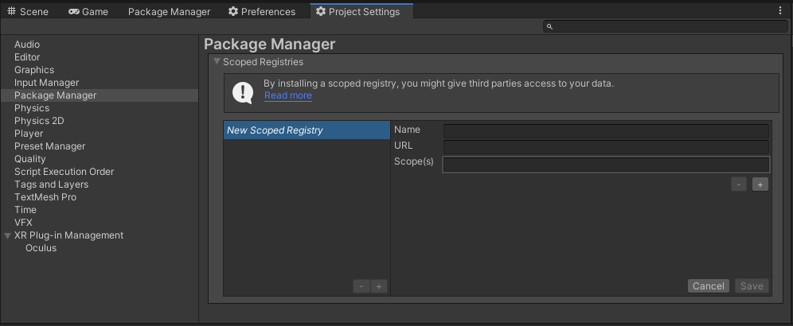

# com.utilities.websockets

[](https://discord.gg/xQgMW9ufN4) [](https://openupm.com/packages/com.utilities.websockets/) [](https://openupm.com/packages/com.utilities.websockets/)

A simple websocket package for the [Unity](https://unity.com/) Game Engine.

## Installing

Requires Unity 2021.3 LTS or higher.

The recommended installation method is though the unity package manager and [OpenUPM](https://openupm.com/packages/com.utilities.websockets).

### Via Unity Package Manager and OpenUPM

- Open your Unity project settings
- Select the `Package Manager`

- Add the OpenUPM package registry:
  - Name: `OpenUPM`
  - URL: `https://package.openupm.com`
  - Scope(s):
    - `com.utilities`
- Open the Unity Package Manager window
- Change the Registry from Unity to `My Registries`
- Add the `Utilities.Websockets` package

### Via Unity Package Manager and Git url

- Open your Unity Package Manager
- Add package from git url: `https://github.com/RageAgainstThePixel/com.utilities.websockets.git#upm`

## Documentation

### Project Setup

```csharp
// TODO
```
